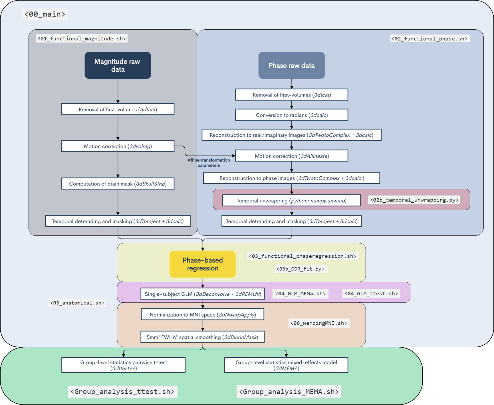

# Phase-based denoising pipeline

This pipeline is organized as following:

* Both single-subject preprocessing and analysis are carried out by executing the script `<00_main.sh>` through the terminal, which sequentially runs the rest of the single-subject scripts. The purpose of these scripts are briefly discussed below.

* Group-level statistics are obtained independently through the terminal (i.e. `<sh Group_analysis_ttest.sh>` and `<sh Group_analysis_MEMA.sh>`).  

For implementation, one would obviously need to change the environment variables for their own subject list, project directory, etc...  
________________
***`<01_functional_magnitude.sh>`***: Functional preprocessing of magnitude images.  
***`<02_functional_phase.sh>`***: Functional preprocessing of phase images. This script executes `<02b_temporal_unwrapping.py>` as well.  
***`<03_functional_phaseregression.sh>`***: Phase-based regression with two different fitting algorithms, i.e. with a least-squares approach and a orthogonal distance regression method (the latter is performed by the script `<03b_ODR_fit.py>`).  
***`<04_GLM_ttest.sh>`***: Computes the General linear model (GLM) separately for the tree types of preprocessed magnitudes (i.e. without any phase-based regression, OLS-denoised and ODR-denoised datasets).  
***`<04_GLM_MEMA.sh>`***: Computes a single GLM with the three types of preprocessed magnitude as input. This is later required by the mixed-effects analysis at the group level.  
***`<05_anatomical.sh>`***: Calculates anatomical volumes and masks. This is not required by the pipeline, but it is convenient for visualization purposes.  
***`<06_anatomical.sh>`***: Transforms the results from the GLM's to the MNI space.  
***`<Group_analysis_ttest.sh>`***: Group-analysis through conventional one-sample t-tests.  
***`<Group_analysis_MEMA.sh>`***: Group-analysis through a mixed-effects model, which accounts for both within- and across- subject variability.  
________________ 

Below, we further illustrate a flow-chart of the pipeline showing the main steps that are performed within each script.  
 
 

 
